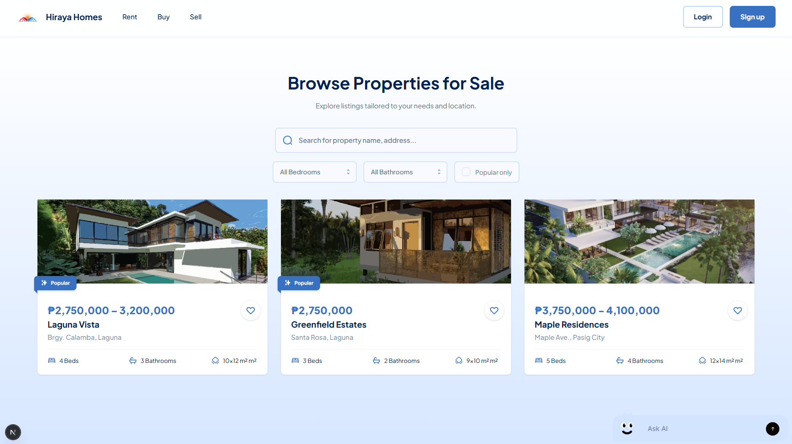
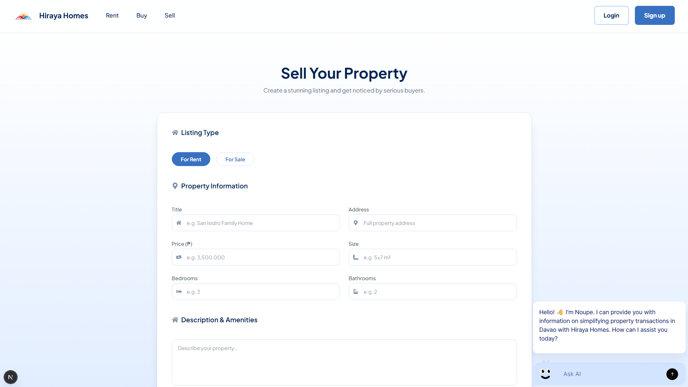

readme_content = """
# 🏡 Hiraya Homes – Real Estate Listing Platform

Hiraya Homes is a real estate listing platform built with **Next.js**, allowing users to **browse**, **filter**, and **submit** property listings for **rent** or **sale**. This app provides a modern UI, clean property cards, and a structured submission form for property sellers.

---

## 🚀 Features

- 🔍 **Property Search**: Search by name, address, or keywords
- 📊 **Filter Controls**: Sort listings by bedrooms, bathrooms, and popularity
- 📄 **Sell Form**: Allows users to submit a property with full details and images
- 🖼️ **Image Previews**: Sellers can upload and preview multiple property images
- 🌟 **Popular Tagging**: Filter and tag listings as popular
- 🧭 **Static JSON**: Properties are read from a static `properties.json` file
- ✨ **Modern Design**: Tailwind CSS + iconography via React Icons
- 🖱️ **Smooth UX**: Page animations via Framer Motion
- 🧠 **Context API**: Scroll to sections with smooth navigation
- 💬 **Noupe Chatbot Integration** 

---

## 🧱 Tech Stack

| Category       | Technology                    |
|----------------|-------------------------------|
| Framework      | [Next.js](https://nextjs.org/) (App Router) |
| Language       | [TypeScript](https://www.typescriptlang.org/) |
| Styling        | [Tailwind CSS](https://tailwindcss.com/) |
| Animation      | [Framer Motion](https://www.framer.com/motion/) |
| Icons          | [React Icons](https://react-icons.github.io/react-icons) |
| Image Handling | `next/image` for optimization |
| State & Hooks  | React `useState`, `useEffect` |
| Chatbot        | [Noupe](https://noupe.ai)     |
| Data           | Static `properties.json` file |
| Package Manager| npm                           |

---

## 📁 Project Structure

```bash
/public
  ├── PropertySection/       # Property thumbnails (SVGs)
  ├── preview_browse.png     # Screenshot for browse page
  ├── preview_sell.png       # Screenshot for sell page

/src
  ├── app/
  │   ├── browse/[listingType]/  # Rent/Buy routes
  │   ├── sell/                  # Sell form page
  │   └── layout.tsx            # Global layout
  │
  ├── components/
  │   ├── button.tsx
  │   ├── headerNavbar.tsx
  │   ├── PropertyCard.tsx
  │   ├── PropertySelector.tsx
  │   ├── section/              # Sectioned content
  │   └── ...
  │
  ├── context/
  │   └── ScrollContext.tsx     # Scroll-to-section behavior
  │
  ├── data/
  │   └── properties.json       # Static listing DB

## 📸 Preview Screenshots

### 🏘️ Browse Page



Browse by rent or buy with filters:
- Bedrooms
- Bathrooms
- Popular listings

### 📝 Sell Page



Add a new property listing:
- Title, address, price, size
- Bedrooms/bathrooms
- Image upload with preview
- Toggle: Rent or Sale

---

## 🛠️ Getting Started

### 1. Clone the repository

```bash
git clone https://github.com/gyrroa/mmcm-the-huntrix-front-end.git
cd hiraya
2. Install dependencies
bash
Always show details

Copy
npm install
3. Run the development server
bash
Always show details

Copy
npm run dev
Then visit: http://localhost:3000

✏️ Future Improvements
✅ Responsive layout 

🗂️ Backend integration for listing storage (MongoDB, Supabase, etc.)

🔐 Authentication (Login/Signup for sellers)

📱 Mobile-first UI pass
